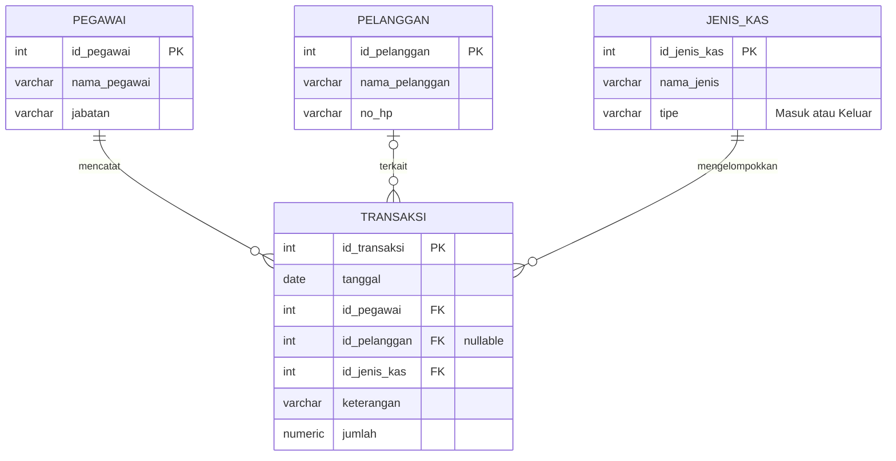

# Tiara Heritage Barbershop — Sistem Kas

## Skema Database

## Tentang

Aplikasi pencatatan kas masuk dan keluar Tiara Heritage Barbershop. Frontend menggunakan HTML, CSS, dan JavaScript biasa; Supabase menyediakan database PostgreSQL dan REST API.

Fitur utama: dashboard saldo, input transaksi, riwayat dengan pencarian/filter, edit dan hapus transaksi, laporan periode, cetak/PDF, serta ekspor Excel.

## Menjalankan

1. Siapkan proyek Supabase dan masukkan Project URL serta publishable/anon key ke `backend/supabase/config.js`.
2. Jalankan `database/database.sql` melalui Supabase SQL Editor.
3. Buka `frontend/index.html` langsung dari folder atau sajikan folder repo melalui web server.

Detail instalasi, alur CRUD, skema, deployment, dan keamanan ada di [Panduan Sistem](docs/panduan-sistem.md).

> SQL saat ini mengaktifkan akses `anon` tanpa login untuk demo. Jangan gunakan kebijakan tersebut untuk pencatatan keuangan produksi tanpa menambahkan autentikasi dan membatasi akses.
